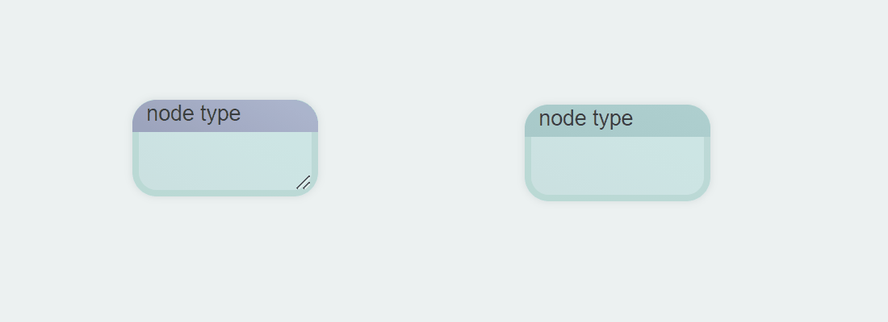
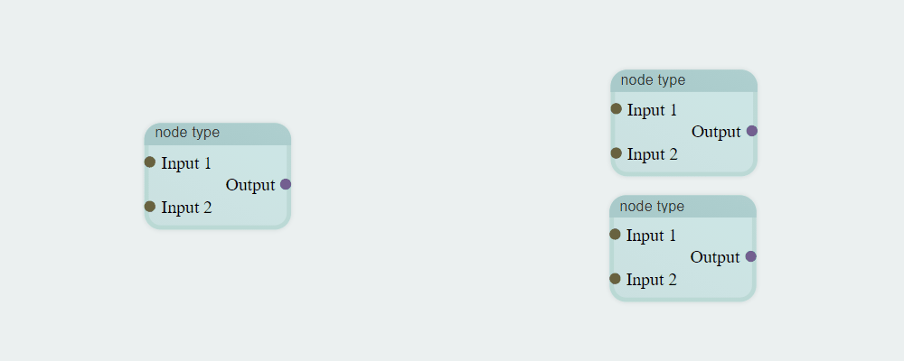
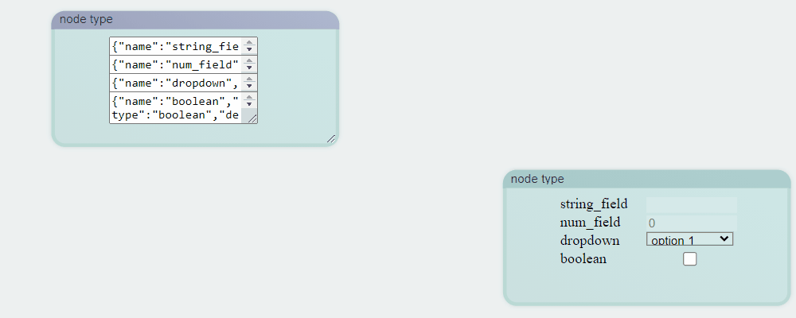

# Flow-Programmer

This is a library to edit flow charts that can be imported and exported in a JSON format.

## Format

Diagrams are loaded and saved in a JSON format. Each node has a template it is based on, which determines the size, terminals, and parameters of the node.



Terminals are either inputs (on the left) or outputs (on the right). Terminals of
different nodes are able to be connected if their types are compatible. Each output terminal can lead to multiple input terminals, but each input terminal
can only accept from one output terminal. The link between these terminals are
called edges.



Currently, parameters are one of four types. Each parameter is defined by a JSON string:

```json
{"name": "<name>","type": "string_field", "default":"<default_string>",
    "tooltip":"<text>"}

{"name": "<name>", "type": "num_field", "default":<default_num>,
    "min":<minimum>, "max":<maximum>,"step":<resolution>, "tooltip":"<text>"}

{"name": "<name>", "type": "dropdown",
    "options":["<option1>", ...], "tooltip":"<text>"}

{"name": "<name>", "type": "boolean",
    "default":<true/false>, "tooltip":"<text>"}
```



The interface to modify templates will be changed in the future.

Parameters and terminals are stored in arrays, indexed from top to bottom. In a template, `parameters` is an array that stores an array of parameter formats, each in a form listed above. An element may be null to signify the absence of a parameter in that location. In a node, parameters are populated by the value that the specific node has.

For example, a template with the name `"justify"` might have the following object:

```json
{
    "dimensions": [180, 90],
    "inputs": [
        ["a", "stream"],
        ["len", "stream"],
        null
    ],
    "outputs": [
        ["result","stream"]
    ],
    "parameters": [
        null,
        null,
        {
            "name": "side",
            "type": "dropdown",
            "tooltip": "Side to add or remove from",
            "options": ["Left", "Right"]
        }
    ]
}
```

- `"dimensions"` specifies the width followed by the height a *justify* node should have in pixels.
- `"inputs"` lists the input terminals a *justify* node should have. The first item of each element is the label for the terminal, and the second is the type that corresponds with the terminal. The third element in `"inputs"` is null, and thus ignored. It has the same behavior as if `"inputs"` only had 2 elements.
- `"outputs"` is in the same format as `"inputs"`, but as the name suggests, corresponds with the output nodes instead.
- `"parameters"` lists the parameter formats. Because the first two elements are null, no parameters correspond with the top two rows of the node.

The resulting node appears as:


with the following JSON:

```json
{
    "coordinates":[1040,144],
    "template":"justify",
    "is_template":0,
    "state":{
        "parameters":[null,null,"Left"],
        "inputs":[[1,0],[1,0]],
        "outputs":[[[2,0]]]
    }
}
```

- `"coordinates"` specifies the location on the diagram this node should be located in pixels. These may be integers or floats.
- `"template"` specifies the template that the node should have.
- `"is_template"` specifies whether or not this node should have the template UI, as the purple nodes above. A zero implies that this node is not a template. This feature will be deprecated in the future.
- `"state"` stores the parameter and terminal data specific to this node.
  - Because *"Left"* is chosen in the dropdown menu, the third parameter matches the chosen value.
  - Each element in `"inputs"` is indexed according to the row the terminal is in. `[1,0]` refers to the $0^{th}$ terminal of the node in index 1. Because the *init* node was the second node created, it is in index 1, and the *a* terminal is in the first row (index 0), signifying the edge connecting these terminals.
  - `"outputs"` is similar, but because each output can output to multiple inputs, each element is an array of pointers. `[[2,0]]` specifies that there is only one terminal that is linked to *result*, which is the *a* terminal of the *end* node. If it was `[[2,0], [3,1]]` instead, there would also be an edge to the fourth (index 3) node at the second (index 1) input terminal.

## Using the API

Currently, __flow_diag.js__ uses classes defined in __flow_style.css__. These two files can be merged, but are currently not. To import them, use

```html
<link rel="stylesheet" type="text/css" href="flow_style.css">
<script type="text/javascript" src="flow_diag.js"></script>
```

To specify an element to hold the diagram, pass the element into the constructor. In the __index.html__ example provided, the following was used:

```javascript
document.getElementById("editor")
diagram = new Diagram(element);
```

in which the json is interacted with using the following functions:

```javascript
diagram.exportJSON() // gets the diagram in a JSON string
diagram.loadJSON(json_str) // sets the diagram according to the given JSON string
```

### Interacting with the GUI

Right click to create a node. If `allow_user_templates` (specified in the Digram constructor) is true, then this will promt whether the node should be a template or not. If not, then the user is then asked to set the template. If the user double clicks on the diagram, the set-template prompty is immediately jumped to.

Dragging the cursor on the diagram pans the diagram, and the mouse wheel zooms in and out.

Inside of a template, the user can resize the node. Right clicking will allow users to create terminals or parameters on the same row as the cursor. Alternatively, a double click on a node will immediately create a terminal or parameter, depending on the cursor location.

A user can delete a node through the menu brought up with a right click.

There is currently no other control scheme.

## In the Future

- Introduce a proper UI
  - create a proper means to modify templates and provide more options for how a template may set how a node looks
  - change controls for accessibility
- Allow creation of comments/annotations on the diagram
- Overhaul the edge system. Currently, the user has no control over edges.

## Developer notes

Currently, tables and dictionaries are stored as objects. This is okay for now, but it should probably be changed to using Maps at some point.
